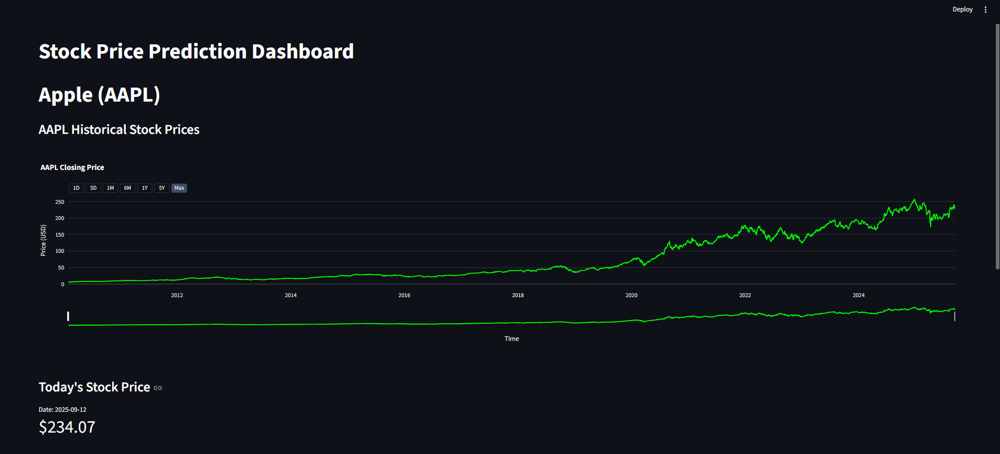
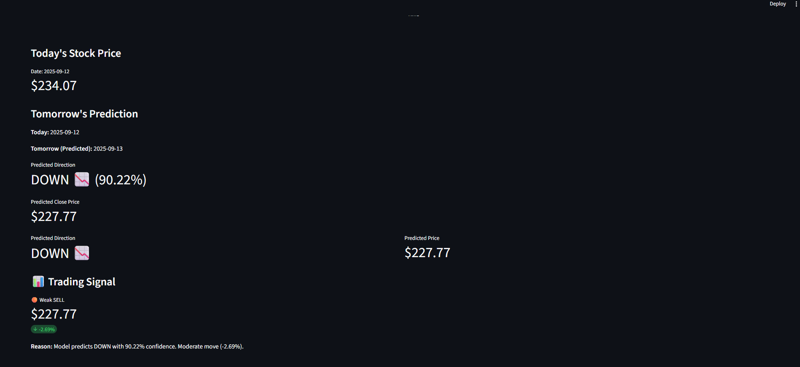

# Stock_Price_Prediction


# 📈 Stock Price Prediction Dashboard  

🚀 An interactive dashboard to analyze stock trends and predict future prices using **Machine Learning (XGBoost)** and **Deep Learning (LSTM)** models. Built with **Streamlit**, it enables real-time stock data visualization, model predictions, and insights for traders and learners.  

---

## 🎯 Scope  

i. 🤖 Predict stock closing prices using **XGBoost** and **LSTM models**.  

ii. 📊 Visualize stock trends with **technical indicators** like RSI, EMA, MA, and Bollinger Bands.  

iii. 🗃️ Provide **historical and predicted stock movement comparison**.  

iv. 🔔 Generate **buy/sell signals** based on model outputs.  

v. ⚡ Automate **data preprocessing and feature engineering** with custom pipelines.  

vi. 🧩 Enable **future extensions** like multi-stock comparison, portfolio analysis, and news sentiment integration.  

---

## 🛠️ Tech Stack  

### Frontend  
- **Streamlit** (Interactive UI)  

### Backend  
- **Python**  

### Machine Learning & Deep Learning  
- **XGBoost** (Tree-based ML model)  
- **LSTM** (Sequential DL model)  

### Data Handling & Visualization  
- **Pandas, NumPy, Scikit-learn**  
- **Matplotlib, Plotly**  

---

## ✨ Features  

### 👤 User-Side  
- Upload or use preprocessed stock datasets  
- View historical price charts with:  
  - Moving Averages (MA, EMA)  
  - Bollinger Bands  
  - RSI (Relative Strength Index)  
- Predict tomorrow’s stock closing price  
- Compare predictions from **XGBoost** and **LSTM**  
- Generate **buy/sell/hold signals** with reasoning  
- Interactive dashboard with live visualization  

### 🔐 Developer-Side (Planned / Optional)  
- Add multiple stock ticker support  
- Integrate APIs for **real-time stock fetching**  
- Automate daily updates of predictions  
- Export predictions and signals as CSV  

---

## 📋 Requirements  

Ensure the following are installed:  

- [Python 3.9+](https://www.python.org/downloads/)  
- [pip](https://pip.pypa.io/en/stable/installation/)  
- [Streamlit](https://streamlit.io/)  

---

## ⚙️ Setup & Installation  

1. **Clone the repo**  
   ```bash
   git clone https://github.com/SAIKOUNDINYAVELURI/Stock_Price_Prediction.git
   cd Stock_Prediction
   ```

2. **Create virtual environment (optional but recommended)**  
   ```bash
   python -m venv venv
   source venv/bin/activate    # Mac/Linux
   venv\Scripts\activate       # Windows
   ```

3. **Install dependencies**  
   ```bash
   pip install -r requirements.txt
   ```

4. **Run Preprocessing & Training (Optional)**  
   ```bash
   python src/preprocess.py
   python src/train_xgb.py
   python src/train_lstm.py
   ```

5. **Start the Dashboard**  
   ```bash
   streamlit run dashboard/app.py
   ```

---

## 📂 Project Structure  

```
Stock_Prediction/
│
├── data/                # Raw & processed datasets
│   ├── stock_data.csv
│   └── features.csv
│
├── models/              # Saved ML/DL models
│   ├── xgb_model.pkl
│   ├── lstm_model.h5
│   └── scaler.pkl
│
├── src/                 # Source code for preprocessing & training
│   ├── preprocess.py
│   ├── train_xgb.py
│   ├── train_lstm.py
│   └── utils.py
│
├── dashboard/           # Streamlit app components
│   ├── app.py
│   ├── components/
│   │   ├── prediction.py
│   │   ├── prediction_card.py
│   │   └── visualization.py
│   └── assets/
│       └── styles.css
│
│
├── requirements.txt     # Python dependencies
└── README.md            # Project documentation
```

---

## 🌐 Web Pages  

1. **Main Dashboard**  
     

2. **Prediction View and Signals & Insights**   
      
    

---

## ⚠️ Known Issues  

- LSTM predictions may vary depending on sequence length and hyperparameters.  
- XGBoost may overfit if features are not scaled properly.  
- Streamlit may throw **`NoneType` errors** if data is missing → ensure preprocessing is run before launching.  

---

## 🧪 Usage  

- Launch the dashboard with:  
  ```bash
  streamlit run dashboard/app.py
  ```  

- Upload or load preprocessed stock dataset.  
- View historical trends & technical indicators.  
- Compare **ML (XGBoost)** vs **DL (LSTM)** predictions.  
- Check **signals** for actionable insights.  
